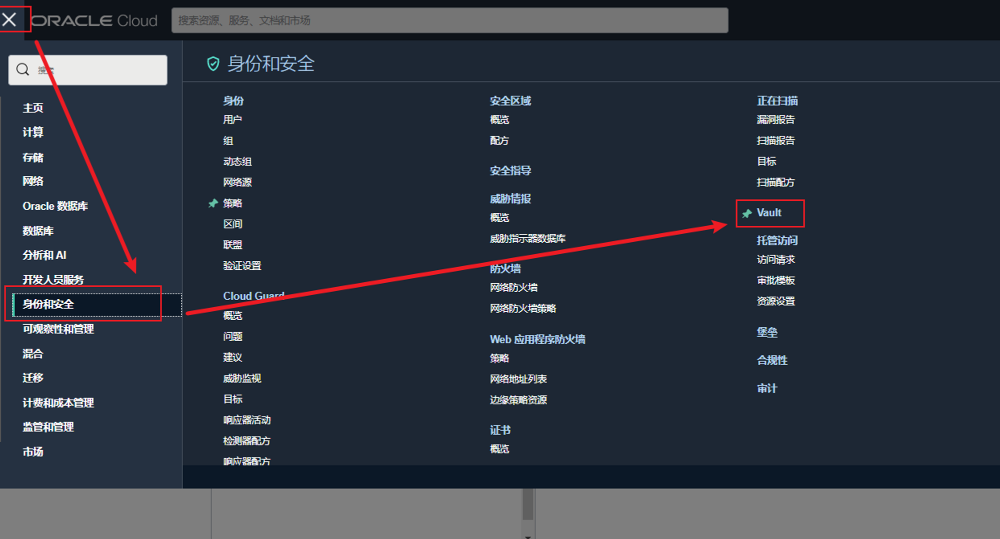

# OKE强制使用OCIR的签名镜像

## 1 背景

用户出于合规和安全等原因，管理员希望我们在生产环境部署应用符合如下安全需求：

* 应用镜像来自被信任的源地址(这里指OKE)
* 应用镜像在部署成功后没有被修改过

## 2 应用场景

通常安全类操作会通过程序集成到开发、测试和生产环境的部署流水线中，通过钩子或者定时扫描的方式进行签名，签名是一个自动完成的过程；本文档主要介绍Sign部分内容，即容器签名。

在部署中通常构建镜像的流程：

* 在CI/CD服务器上进行容器的构建
* 对构建成功的容器打上对应的标签
* 通过OCI Vault为容器增加签名
* OKE拉取签名镜像(此时OKE已打开镜像签名校验)

构建CI/CD流程大致如下↓：

.png>)

签名校验流程：

.png>)

## 3 前提准备

### 3.1 Vault创建

Oracle Cloud Infrastructure Vault 是一项密钥管理服务，用于存储和管理主加密密钥和机密以安全访问资源。这里主要用于为容器镜像增加签名和OKE镜像通过签名验证容器镜像的一致性。



#### 3.1.1 创建Vault

.png>)

#### 3.1.2 创建主加密密钥

目前镜像支持RSA和ECDSA两种加密算法。

.png>)

### 3.2 OKE集群

可参考如下内容：

[创建自定义集群流程(未完成)](https://www.notion.so/305acae24c8a4f29a4fcf43eeae42d32)

### 3.3 镜像仓库

可参考如下内容：

[通过OCIR上传/下载容器镜像](https://www.notion.so/OCIR-7ca8319c079140a8810284cebac55b83)

### 3.4 OKE镜像签名验证所需IAM策略

OKE需要可以读取镜像仓库和使用Key的权限，**注意：此权限目前仅支持租户级权限**

```
Allow any-user to use keys in tenancy where request.user.id=<CLUSTER_OCID> 
Allow any-user to read repos in tenancy where request.user.id=<CLUSTER_OCID>
```

## 4 开启OKE 镜像签名验证功能

### 4.1 创建OKE时开启镜像签名验证功能

1. 展开”隐藏高级选项”
2. 勾选”在此集群上启用映像验证策略”
3. 选择使用的KEY信息

.png>)

### 4.2 OKE运行时开启镜像签名验证功能

## 5 构建镜像与发布

### 5.1 编写测试dockerfile

测试镜像，用于构建nginx镜像：

```docker
FROM centos:7.9.2009
RUN buildDeps='readline-devel pcre-devel openssl-devel gcc telnet wget curl make' \
&& useradd -M -s /sbin/nologin nginx \
&& mkdir -p /usr/local/nginx/conf/vhost \
&& mkdir -p /data/logs/nginx \
&& yum -y install $buildDeps \
&& yum clean all \
&& wget http://nginx.org/download/nginx-1.14.2.tar.gz \
&& tar zxf nginx-1.14.2.tar.gz \
&& cd nginx-1.14.2 \
&& ./configure --prefix=/usr/local/nginx \
    --with-http_ssl_module \
    --with-http_stub_status_module \
&& make -j 1 && make install \
&& rm -rf /usr/local/nginx/html/* \
&& echo "ok" >> /usr/local/nginx/html/status.html \
&& cd / && rm -rf nginx-1.14.2* \
&& ln -sf /usr/share/zoneinfo/Asia/Shanghai /etc/localtime

ENV PATH /usr/local/nginx/sbin:$PATH
WORKDIR /usr/local/nginx
EXPOSE 80
CMD ["nginx", "-g", "daemon off;"]
```

### 5.2 登录镜像仓库

```shell
#  用户名有两种:
#    - 普通IAM用户格式：<tenancy-namespace>/<username>
#    - 联邦用户格式： <tenancy-namespace>/oracleidentitycloudservice/<username>
#
#  password为认证token


#1. 登录镜像仓库
$root > docker login ap-tokyo-1.ocir.io
username: xxx/oracleidentitycloudservice/xx.xxx@oracle.com
password: <user token>
```

### 5.3 构建镜像

```shell
# 构建镜像
# 镜像标签的组合为<region name>/<namespace name>/<images name>

docker build -t ap-tokyo-1.ocir.io/cnstphowy3cb/dev-app:v1 -f DockerFile

# 查看当前构建的镜像，标注背景色的镜像为我们要推送至仓库的镜像
[root@instance-20221212-1501 ~]# docker images
Emulate Docker CLI using podman. Create /etc/containers/nodocker to quiet msg.
REPOSITORY                               TAG         IMAGE ID      CREATED         SIZE
ap-tokyo-1.ocir.io/cnstphowy3cb/dev-app  v1          3bb00c0e9770  35 seconds ago  328 MB
quay.io/centos/centos                    7.9.2009    8652b9f0cb4c  2 years ago     212 MB
```

### 5.4 推送镜像至OCIR镜像仓库

```shell
# 推送镜像至仓库
docker push ap-tokyo-1.ocir.io/cnstphowy3cb/dev-app:v1
```

推送成功后在镜像仓库中可以看到刚刚发布的v1版本镜像

.png>)

## 6 镜像签名

容器签名操作在每次镜像发布后进行，通过容器数字ID与主密钥生成一致性信息，保证容器的完整性。

### 6.1 获取容器ID

#### 6.1.1通过console界面获取

.png>)

#### 6.1.2 通过命令行获取

```
oci artifacts container image list --compartment-id <compartment-id>
{
  "data": {
    "items": [
      {
        "compartment-id": "ocid1.compartment.oc1x",
        "digest": "sha256:e7a4c186eef137a75caacae308765dc2fbb2f57c36d95c0b3ccf6efe6d912ec1",
        "display-name": "dev-app:v1",
        "id": "ocid1.containerimage.oc1.ap-tokyo-1.0.cnstphowy3cb.aaaaaaaakzn4quqonn7wrkys5o4ms7h6yykzkm5raggd7iwoetopyolptneq",
        "lifecycle-state": "AVAILABLE",
        "repository-id": "ocid1.containerrepo.oc1.ap-tokyo-1.0.cnstphowy3cb.aaaaaaaao5wmjdfjd7v6ivy4h4ckzquww3a7famuymokimr2n7tip54qcdsq",
        "repository-name": "dev-app",
        "time-created": "2022-12-12T10:13:24.550000+00:00",
        "version": "v1"
      }
    ],
    "remaining-items-count": 0
  }
}
```

### 6.2 获取KEY信息

签名时需要使用密钥OCI和密钥版本

#### 6.2.1 通过console界面获取

.png>)

### 6.3 镜像签名

#### 6.3.1 镜像签名

```shell
oci artifacts container image-signature sign-upload --compartment-id <compartment-ocid> --kms-key-id <key-ocid> --kms-key-version-id <key-version-ocid> --signing-algorithm <signing-algorithm> --image-id <image-ocid> --description <signature-description> --metadata <image-metadata-json>

oci artifacts container image-signature sign-upload --compartment-id ocid1.compartment.oc1..aaaaaaaatkzpafvu44t6gcpqk5nz7nykngxhpkzalmfn6u3wdesdm6f323ma --kms-key-id ocid1.key.oc1.ap-tokyo-1.cnrzn4zwaaeam.abxhiljre5yt3upn2bgik2lejscd7lvox7ygr4w3lh2wggey5statloap54q --kms-key-version-id ocid1.keyversion.oc1.ap-tokyo-1.cnrzn4zwaaeam.csiqmolpmhiaa.abxhiljri5uf7tw6qkrs3lcz5v764npnsk4f6cdrfpcv5sig7hcetu52vrfa  --signing-algorithm SHA_256_RSA_PKCS_PSS --image-id ocid1.containerimage.oc1.ap-tokyo-1.0.cnstphowy3cb.aaaaaaaakzn4quqonn7wrkys5o4ms7h6yykzkm5raggd7iwoetopyolptneq --description "Image for DEV testing"

# --ompartment-id # 镜像所在的隔间的OCID
# --kms-key-id # 用于对镜像签名的主加密密钥的OCID
# --kms-key-version-id # 用于对镜像进行签名的密钥版本的OCID
# --signing-algorithm # 镜像签名所用的算法
# --image-id # 被签名的镜像OCID
# --description # 镜像签名的描述信息
```

执行后会返回相关的绑定信息

.png>)

#### 6.3.2 镜像签名验证

```shell
# 命令
oci artifacts container image-signature get-verify --compartment-id <compartment-ocid> --repo-name <repository-name> --image-digest <image-digest> --trusted-keys <key-ocid> --compartment-id-in-subtree true|false

# 示例
oci artifacts container image-signature get-verify --compartment-id ocid1.compartment.oc1..aaaaaaaatkzpafvu44t6gcpqk5nz7nykngxhpkzalmfn6u3wdesdm6f323ma --repo-name dev-app --image-digest sha256:e7a4c186eef137a75caacae308765dc2fbb2f57c36d95c0b3ccf6efe6d912ec1 --trusted-keys ocid1.key.oc1.ap-tokyo-1.cnrzn4zwaaeam.abxhiljre5yt3upn2bgik2lejscd7lvox7ygr4w3lh2wggey5statloap54q

# --compartment-id 镜像所在的隔间的OCID
# --repo-name # 镜像仓库名称
# --image-digest # 容器数字签名
# --trusted-keys # 主加密密钥OCID
```

签名验证通过信息如下：

.png>)

## 7 OKE创建OCIR镜像仓库认证

```shell
# 添加镜像仓库认证
kubectl create secret docker-registry ocirsecret --docker-server=ap-tokyo-1.ocir.io --docker-username='cnsxxxb/oracleidentitycloudservice/xxx@jahwa.com.cn' --docker-password='xxx' --docker-email='coxxx@xx.com.cn'

# --docker-server # 镜像服务器所在的region，<regionName>.ocir.io
# --docker-username # 容器仓库认证用户名
# --docker-password # 容器仓库认证用户token
# --docker-email # 容器认证邮箱地址
```

## 8 OKE使用签名镜像进行应用部署

### 8.1 正确部署

```yaml
apiVersion: v1
kind: Pod
metadata:
  creationTimestamp: null
  labels:
    run: pod-2
  name: pod-2
  #annotations:
  # oracle.image-policy.k8s.io/break-glass: "true"  # 如果当前镜像部署想跳过限制，可通过oracle.image-policy.k8s.io/break-glass: "true" 注释绕过规则。
spec:
  containers:
  - image: ap-tokyo-1.ocir.io/cnstphowy3cb/dev-app@sha256:e682e7302fa2c0a444d0d05408cd5c0cd393a8481329633963d649c9dc758470  # @sha256: xxx 是数字签名
    name: pod-2
    resources: {}
  dnsPolicy: ClusterFirst
  restartPolicy: Always
  imagePullSecrets:
  - name: ocirsecret
status: {}
```

### 8.2 异常部署

```yaml
apiVersion: v1
kind: Pod
metadata:
  creationTimestamp: null
  labels:
    run: pod
  name: pod
  #annotations:
  #  oracle.image-policy.k8s.io/break-glass: "true"
spec:
  containers:
  - image: nginx  # 部署的镜像非OKE镜像仓库，且未进行签名
    name: pod
    resources: {}
  dnsPolicy: ClusterFirst
  restartPolicy: Always
status: {}

#####收到如下的报错：
Error from server (Forbidden): error when creating "pod-1.yaml": pods "pod" is forbidden: an error on the server ("unknown") has prevented the request from succeeding
```

## 9 参考内容

镜像签名

[https://docs.oracle.com/en-us/iaas/Content/Registry/Tasks/registrysigningimages\_topic.htm](https://docs.oracle.com/en-us/iaas/Content/Registry/Tasks/registrysigningimages\_topic.htm)

Vault密钥管理

[https://docs.oracle.com/en-us/iaas/Content/KeyManagement/Tasks/managingkeys.htm#createnewkey](https://docs.oracle.com/en-us/iaas/Content/KeyManagement/Tasks/managingkeys.htm#createnewkey)

OKE通过OCIR镜像仓库拉取镜像

[https://docs.oracle.com/en-us/iaas/Content/ContEng/Tasks/contengpullingimagesfromocir.htm](https://docs.oracle.com/en-us/iaas/Content/ContEng/Tasks/contengpullingimagesfromocir.htm)

OKE使用镜像签名

[https://docs.oracle.com/en-us/iaas/Content/ContEng/Tasks/contengenforcingsignedimagesfromocir.htm#Enforcing\_Use\_of\_Signed\_Images\_from\_Registry](https://docs.oracle.com/en-us/iaas/Content/ContEng/Tasks/contengenforcingsignedimagesfromocir.htm#Enforcing\_Use\_of\_Signed\_Images\_from\_Registry)
